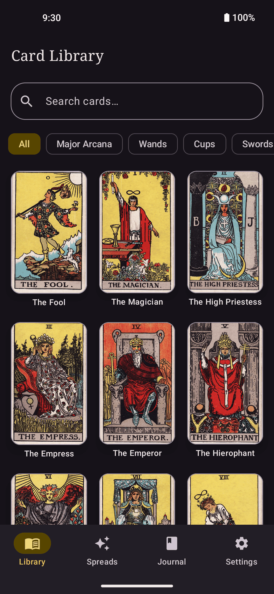
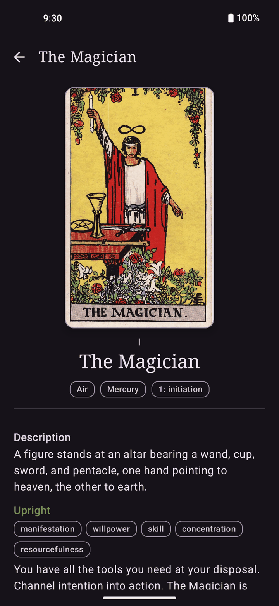
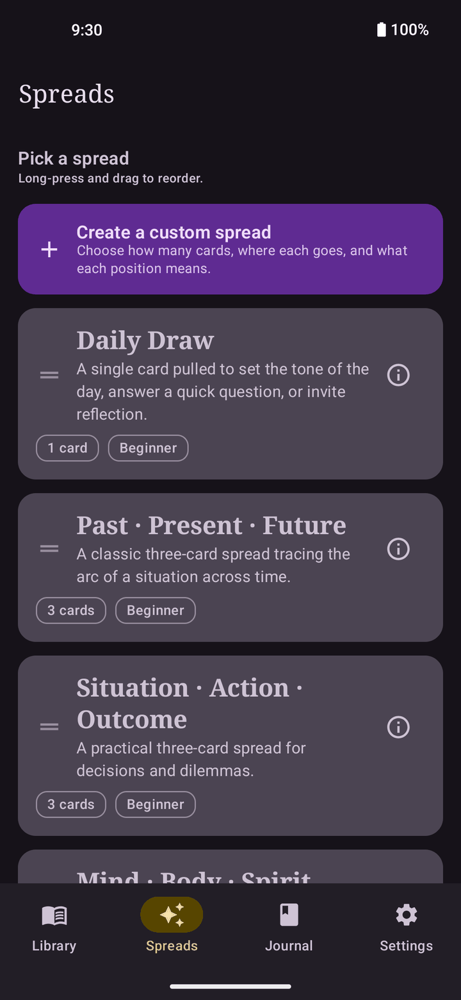
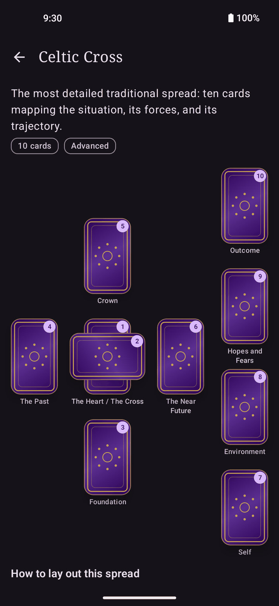
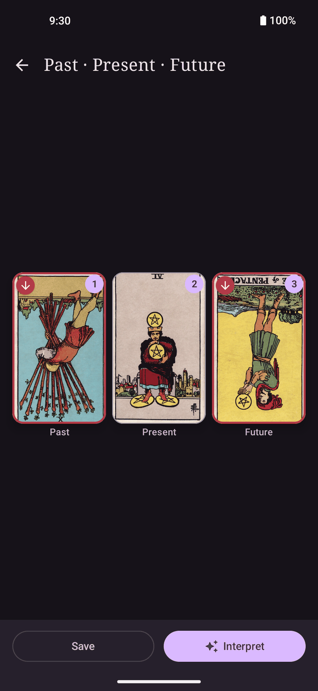
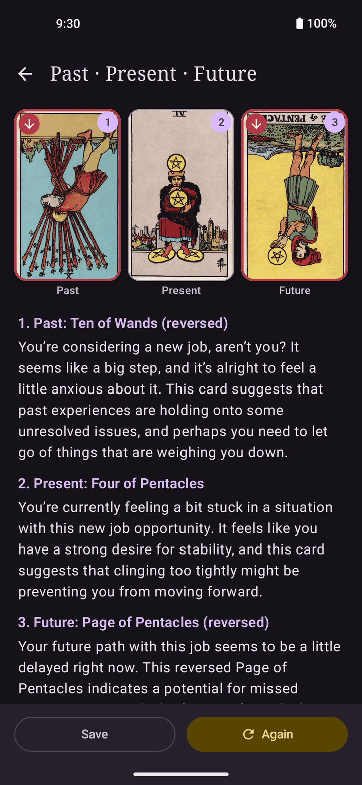
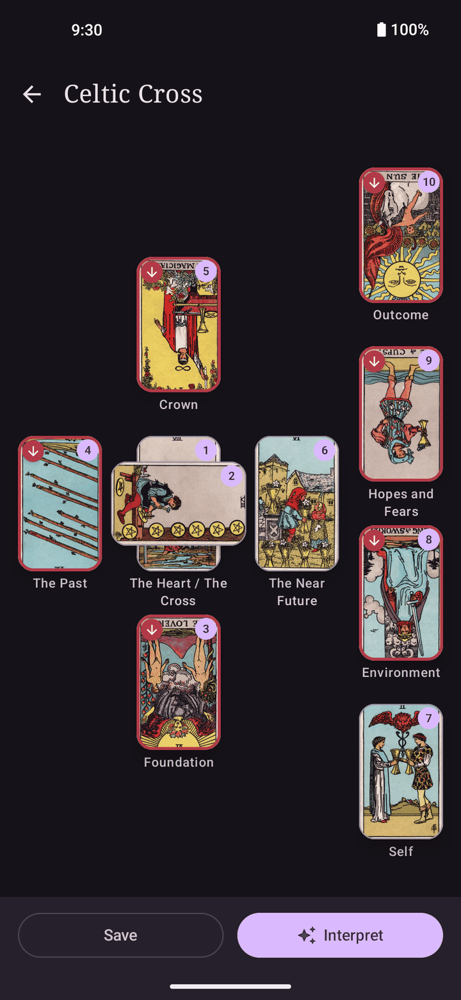
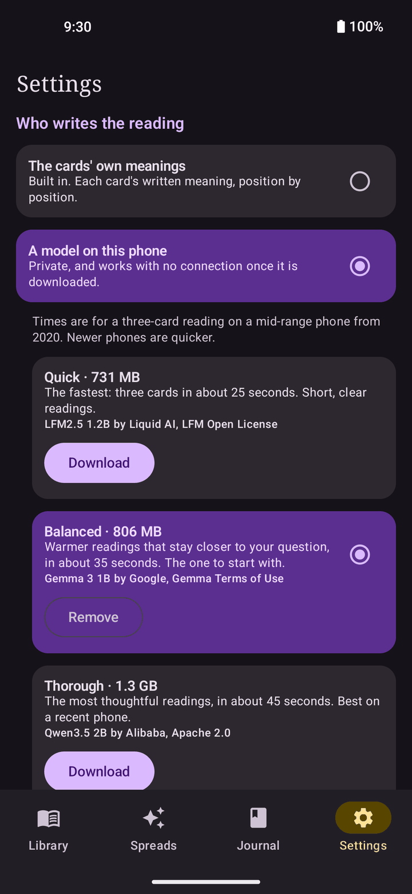
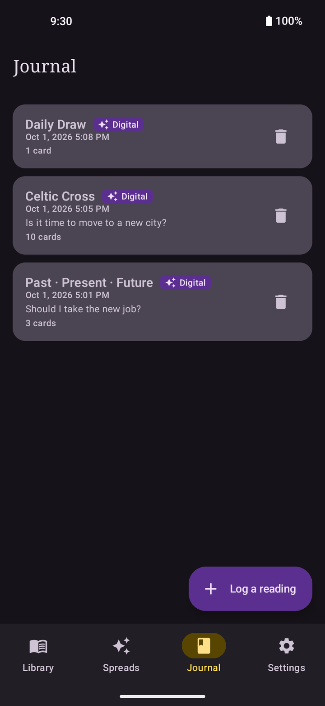
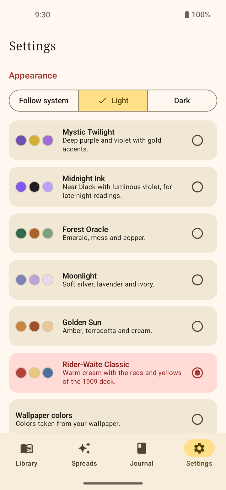

<div align="center">


# Arcana

**A tarot deck, its meanings and a reading journal, with readings written by a model that runs on your phone.**

[](https://apps.obtainium.imranr.dev/redirect?r=obtainium://add/https://github.com/PimpinPumpkin/Arcana)&nbsp;&nbsp;[](https://github.com/PimpinPumpkin/Arcana/releases/latest)

Android 8 or later. No account, no ads, and nothing leaves the phone unless you choose Claude.

</div>

| Library | A card | Spreads | A spread's guide | Three cards |
|:-:|:-:|:-:|:-:|:-:|
|  |  |  |  |  |

| A reading | Celtic Cross | Models | Journal | Themes |
|:-:|:-:|:-:|:-:|:-:|
|  |  |  |  |  |

The most obvious vibe-coded esoteric app around. Whimsical and odd. Arcana is a deck you can look
things up in, a set of spreads to lay it out in, and a journal for what came up. It can also write
the reading for you, and it does that on the phone.

## Cards

- **All 78 cards**, each with its upright and reversed meaning, keywords, element, astrology and
  numerology.
- **Search** by name, keyword, number or roman numeral, and filter by suit.
- **Look closer.** Tap the art to fill the screen with it, then pinch to zoom.

## Spreads

- **Eight spreads built in**: Daily Draw, three three-card spreads, Horseshoe, Celtic Cross,
  Relationship and Year Ahead.
- **A guide for each one**: what every position means, and how to lay it out with a real deck.
- **Cards as large as the screen allows**, with each position named under its card.
- **Make your own.** Choose how many cards, where each one goes and what each position means.
- **Drag the list** into the order you use them in.

## Readings

- **Pull cards in the app.** Ask a question or leave it open, pick a tone, shuffle.
- **Or log a reading you did with a real deck**, one position at a time.
- **Reversed cards** if you read with them, upright only if you do not.
- **Tap any card** in a spread to open its page.
- **Three ways to have it interpreted:**
  - **The cards' own meanings**, position by position. Built in, offline, and what the app does
    until you choose otherwise.
  - **A model on the phone.** One download of 0.7 to 1.3 GB. After that it needs no connection,
    and nothing you ask leaves the phone. It writes a few sentences on each card and then ties
    them together, in the tone you picked: grounded, poetic, practical or gentle.
  - **Claude**, with your own Anthropic API key.

## Journal

- **Save any reading** with its question, the cards as they fell and the interpretation.
- **Add notes** whenever you come back to it. They save as you type.
- **Interpret a saved reading again**, with a different model if you have changed your mind.
- **Back up** readings and custom spreads to one file, and bring them in on another phone.

## Make it yours

- **Your own deck.** Import a folder or a ZIP of card images, or set cards one at a time. Files
  named like "Queen of Cups" or "Wands05" are recognized, so most decks need no renaming.
- **Share a deck** as a ZIP that anyone with Arcana can import.
- **Six themes**, each in light and dark, or your wallpaper's colors.

Arcana is a hobby project, so expect a rough edge or two;
[open an issue](https://github.com/PimpinPumpkin/Arcana/issues) if you find one.

---

## More

<details>
<summary><b>Installing and updates</b></summary>

<br>

**Obtainium** (recommended) installs the app and keeps it updated. **Download APK** takes you to
the latest release: download the `.apk` file and open it.

| Channel | What it is | How often |
| --- | --- | --- |
| **Stable** | The newest nightly, promoted | Weekly |
| **Nightly** | Built from `main` | Every day `main` changes |
| **Canary** | Built from the `canary` branch | Every push |

All three share one signing key and one rising version code, so moving between them is a plain
update.

</details>

<details>
<summary><b>Check you got the real thing</b></summary>

<br>

Every Arcana APK, from any channel, is signed with the same key. Its certificate fingerprint is:

```
SHA-256  2D:42:BD:2C:77:03:F2:1A:A0:EA:6D:FB:F4:0B:61:25:E4:4D:8E:1A:E4:EE:1C:A2:63:1F:1E:8D:53:83:75:09
```

Check a downloaded file against it before installing:

```bash
apksigner verify --print-certs arcana-*.apk
```

On the phone, [App Verifier](https://github.com/soupslurpr/AppVerifier) checks the same thing. It
wants the package name on the first line and the fingerprint on the second:

```
com.arcana.app
2D:42:BD:2C:77:03:F2:1A:A0:EA:6D:FB:F4:0B:61:25:E4:4D:8E:1A:E4:EE:1C:A2:63:1F:1E:8D:53:83:75:09
```

Android enforces this for you after the first install: an update signed with a different key is
refused.

</details>

<details>
<summary><b>Models and download sizes</b></summary>

<br>

The app works without a model: it reads the cards' own meanings. To have readings written for
you, download one of these in Settings, or when the app offers the first time you tap Interpret.

| Name in the app | Model | Download | Three-card reading |
| --- | --- | --- | --- |
| Quick | LFM2.5 1.2B | 731 MB | 23 s |
| Balanced | Gemma 3 1B | 806 MB | 33 s |
| Thorough | Qwen3.5 2B | 1.3 GB | 41 s |

- The times were measured on a Pixel 4a 5G, a mid-range phone from 2020, and include loading the
  model. Newer phones are quicker.
- Balanced is the one to start with. Quick suits older phones. Thorough writes the best readings
  and wants a recent phone.
- Any other GGUF chat model can be used: Settings has "Use a model file I already have". The same
  row takes one of the three above if you fetched it on another device.
- A download can be paused, keeps going with the screen off, and carries on where it stopped
  if the app is closed partway.
- The model needs a 64-bit ARM phone. On anything else the rest of the app still works.
- Two older models, Qwen 2.5 0.5B and 1.5B, stay usable if an earlier version installed them.
  They are no longer offered: the three above write better readings in the same time or less.

</details>

<details>
<summary><b>Privacy</b></summary>

<br>

| What you do | Who hears about it |
| --- | --- |
| Look up cards, pull or log a reading, keep the journal | **Nobody.** All of it stays on the phone |
| Have a reading written by the model on the phone | **Nobody** |
| Download a model | **Hugging Face**, which sees a file download and nothing else |
| Import a model from a file instead | **Nobody** |
| Have a reading written by Claude | **Anthropic**, which gets the cards, your question and your API key |
| Export a backup or a deck | **Wherever you save the file** |

No analytics, no crash reporting, no accounts. The app uses the network for two things, both of
which you ask for: downloading a model, and readings from Claude.

If Android's own backup is turned on, the journal and your custom spreads are included in it.
Settings, which is where an API key lives, and imported decks are left out of the cloud backup and
only move in a direct phone-to-phone transfer.

</details>

<details>
<summary><b>How it works</b></summary>

<br>

**The reading.** A small model drifts when asked to hold a format across a whole reading: it
skips cards, invents ones that were not drawn and mangles headings. So the app keeps the
structure. A reading is run as a short conversation, one card per turn. The app writes the
headings and decides which card comes next, and the model is only ever asked for two or three
sentences about one card, with that card's keywords in front of it. A last turn asks for a
summary.

- The keywords come from the app's own card data, not from the model's memory of tarot.
- A grammar holds every reply to whole sentences that open on the reader, so a reply cannot turn
  into a list, run on, or start with a greeting.
- The chat format is read from the model file, so a model you import is spoken to the way it was
  trained.
- One reading runs at a time, and it can be stopped between any two words.

**The engine.** [llama.cpp](https://github.com/ggml-org/llama.cpp), built from source as a
submodule, on the CPU. It ships one math library per generation of ARM processor and uses the
best one that every core of the phone can run, down to a plain one for the oldest 64-bit chips.
On a 2020 phone, with a small model, the right library is the difference between 43 and 70 tokens
a second when reading the prompt. About, in Settings, says which one a phone got. Writing uses
the phone's fast cores; reading the prompt uses all of them.

**The spreads.** A spread is a list of positions on a unit square. A layout solver finds the
largest card size at which nothing overlaps, counting cards that lie sideways, and keeps the
position names under the cards when they cost little of that size. Spreads you design go through
the same solver.

**The rest.**

- The journal is a Room database with a migration for every schema change that shipped.
- Card art is WebP, 960 pixels wide. An imported deck's oversized images are scaled down as they
  come in.
- Each version of the app pins the model files it offers by SHA-256 and downloads them from a
  fixed revision, so a file cannot change underneath it.
- `service/service-ai/tools/reading-cli` runs the same model code on a desktop, which is how a
  new model gets tried before it goes in the picker.

</details>

<details>
<summary><b>Known gaps</b></summary>

<br>

- The on-device models are small. They stay on a card's meaning because the app hands it to them,
  but they repeat themselves and sometimes misread what a position is about.
- Two of the three models are not open source: Gemma and LFM have their own terms. Qwen is
  Apache 2.0.
- Models come from Hugging Face only. If a publisher removes a file, that model stops downloading
  until the app is updated.
- The app's own text is English only.
- Laid out for a phone held upright. Tablets and landscape have not been tested.
- Not on F-Droid.

</details>

<details>
<summary><b>Building and contributing</b></summary>

<br>

```bash
git clone --recurse-submodules https://github.com/PimpinPumpkin/Arcana.git
cd Arcana
./gradlew assembleRelease
```

JDK 17 and the Android SDK with platform 37, NDK 28.2.13676358 and CMake 3.22.1. If you cloned
without `--recurse-submodules`, run `git submodule update --init --recursive`.

The APK lands in `app/build/outputs/apk/release/`. It is signed with the debug key unless
`ARCANA_KEYSTORE_PATH`, `ARCANA_KEYSTORE_PASSWORD` and `ARCANA_KEY_ALIAS` are set. Build the
release variant even for everyday use: debug builds are not minified, and scroll badly.

```bash
./gradlew testDebugUnitTest :core:core-domain:test
```

runs the tests: the spread layout solver, the reading script and its grammar, text streaming,
thread selection, card file names, and the contrast of every theme.

```bash
./gradlew :core:core-database:connectedDebugAndroidTest
```

checks, on an emulator, that a journal written by each released version still opens.

To try a model or a change to the prompt without installing anything, see
[service/service-ai/tools/reading-cli](service/service-ai/tools/reading-cli/README.md).

```
app/                    entry point, navigation, What's new
baselineprofile/        records the startup profile the release build carries
core/
  core-common/          dispatchers and shared plumbing
  core-domain/          models, repository interfaces, use cases. Plain Kotlin.
  core-data/            card and spread JSON, settings, custom decks, backup
  core-database/        Room: the journal and custom spreads, with migrations
  core-ui/              theme and shared components, spread layout math
feature/
  feature-library/      card grid and card pages
  feature-spreads/      spread list, guide, editor, and the reading itself
  feature-journal/      saved readings, logging a physical reading
  feature-settings/     themes, decks, models, backup
service/
  service-ai/           the three interpreters, and the on-device model
```

Issues and pull requests are welcome. Two house rules, both checked by `scripts/check-writing.sh`
and by CI: US English, and no em dashes. Commit subjects are used verbatim as release notes, so
write them as plain sentences about what changed for the person using the app.

</details>

## License

GPL-3.0. See [LICENSE](LICENSE).

The card meanings are original to this project. The models are downloaded from their publishers
under the terms below and are not part of this repository.

| Component | License |
| --- | --- |
| Rider-Waite-Smith card art (Pamela Colman Smith, 1909), from Wikimedia Commons | Public domain |
| [llama.cpp](https://github.com/ggml-org/llama.cpp) | MIT |
| LFM2.5 1.2B | LFM Open License v1.0 |
| Gemma 3 1B | Gemma Terms of Use |
| Qwen3.5 2B, Qwen 2.5 | Apache 2.0 |
| [MaterialKolor](https://github.com/jordond/materialkolor) color utilities | MIT |
| AndroidX, Compose, Hilt, Coil, OkHttp, kotlinx | Apache 2.0 |
